# tarea 5 en parejas

## hacemos un fork para trabajar el repositorio de bruno

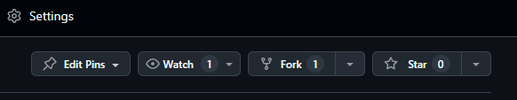

## Clonamos el fork para trabajar en linea de comandos
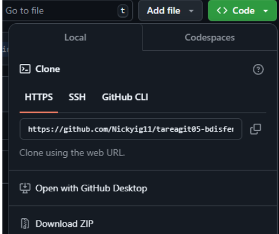
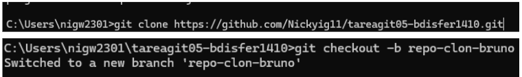

## usamos git bash para crear un nano .java
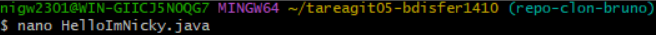

## añadimos el .java y hacemos un commit
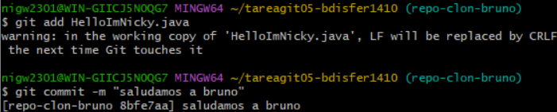

## comprobamos el estado
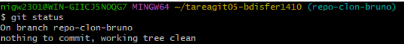

## por ultimo sacamos el nombre del repositorio
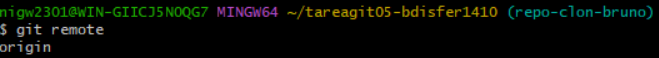

## con el nombre y el cheskout hacemos un pull para subirlo a nuestro repositorio en github
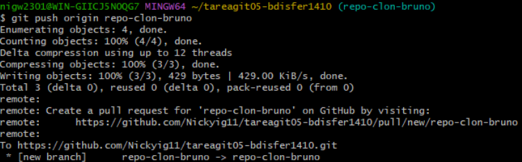

## una vez que este en nuestro repo hacemo un pull request para subir nuestros cambios al repositorio main, el de bruno.
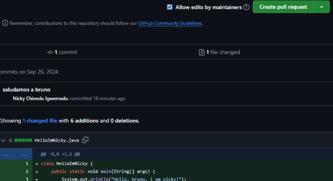
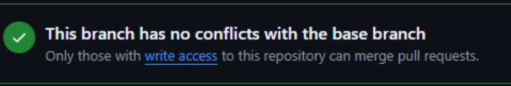

## Bruno ha realizado los mismo pasos pero en mi mi repo y ahora yo tengo que aceptar su pull request y hacer un merge para fusionar su rama con mi rama main
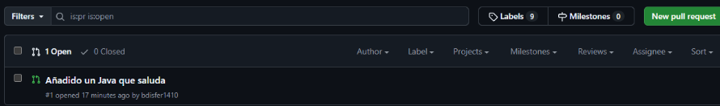

### El merge
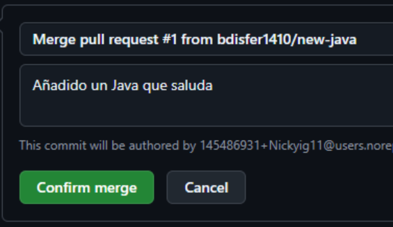

## Comprobar que se ha subido el .java a mi repositorio
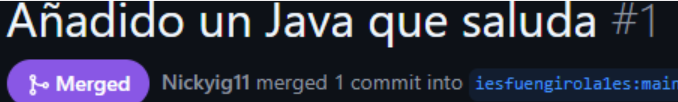 
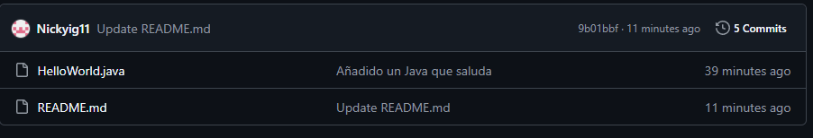

## último commit añadidle un tag que se llame "v1.0

##   clone del repositorio del tag "v1.0"

